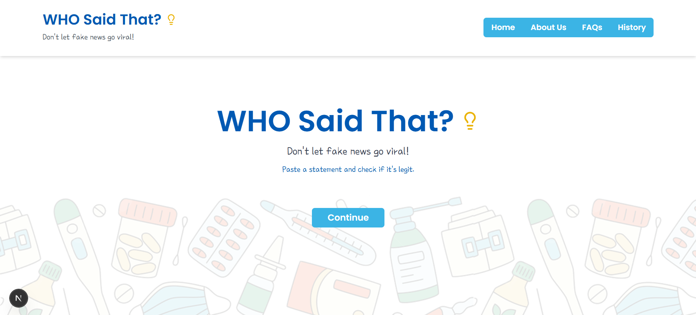

# 🧠 WHO Said That?

An AI-powered fake news detection app built with modern web technologies. Users can input any claim or statement, and the app will verify its authenticity using a trained machine learning model served via a Flask API.

---

## 🖥️ System Specs

| Feature           | Description                                |
|------------------|--------------------------------------------|
| 💻 OS             | Windows 11 Home                            |
| 🧠 Processor      | Intel® Core™ i5-8365U CPU @ 1.60GHz (1.90GHz Turbo) |
| 🔋 Installed RAM  | 16 GB (15.7 GB usable)                     |
| 💾 Storage        | SSD (recommended for faster node_modules)  |

---

## 🛠️ Software Stack

| Category     | Tech                        |
|--------------|-----------------------------|
| Frontend     | Next.js 15 (App Router)     |
| Styling      | TailwindCSS 3 + CSS Modules |
| Language     | TypeScript                  |
| Fonts        | Google Fonts (`Poppins`, `Poor Story`) |
| UI/UX        | Radix UI, Lucide Icons      |
| Animation    | tailwindcss-animate         |
| Backend      | Flask (Python 3)            |
| ML Model     | `.pkl` Fake News Classifier |
| Hosting      | Local / Vercel (Optional)   |

---

## 📸 App Preview

> 

---

## 🚀 Getting Started

### 1. Clone the repo

```bash
git clone https://github.com/YOUR_USERNAME/WHO-SAID-THAT.git
cd WHO-SAID-THAT
```

### 2. Install dependencies

```bash
npm install
```

### 3. Run the frontend

```bash
npm run dev
```

Visit: [http://localhost:3000](http://localhost:3000)

### 4. Start Flask Backend

Make sure your Flask backend is:
- Running at `http://localhost:5000`
- Serving predictions from your `.pkl` ML model

---

## 📁 Project Structure

```bash
who-said-that-new/
├── app/
│   ├── layout.tsx
│   ├── page.tsx
│   └── globals.css
├── components/
│   ├── ui/
│   └── header.tsx
├── lib/
│   └── utils.ts
├── public/
│   └── background.png
├── tailwind.config.ts
├── tsconfig.json
└── README.md
```

---

## 🧪 Troubleshooting

| Issue                                   | Solution |
|----------------------------------------|----------|
| 🚫 Background image not found          | Place `background.png` inside the `public/` folder |
| 🔴 Font or Tailwind not loading        | Recheck `globals.css` and Tailwind config |
| 🧠 ML predictions not working          | Ensure Flask backend is running & accessible |
| ⚠️ ESLint `no-unescaped-entities`     | Escape `'` as `&apos;` or disable rule |
| 🧩 Peer dependency conflict            | Use `npm install --legacy-peer-deps` |

---

## 🔐 .gitignore

The following files and folders are excluded from version control:

```gitignore
/node_modules
/.next
/out
.env
/build
.DS_Store
*.pem
*.tsbuildinfo
```

---

## 📦 Production Build

```bash
npm run build
npm run start
```

---

## 🧠 AI Model

- Format: `.pkl` (Pickle)
- Task: Fake News Classification
- Hosted via: Flask REST API

---

## 🤖 Contribution

PRs welcome. Please open an issue first to discuss your ideas.

---

## 📄 License

MIT © Qurat-ul-ain — 2025
